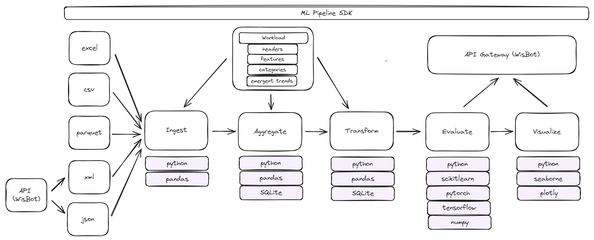
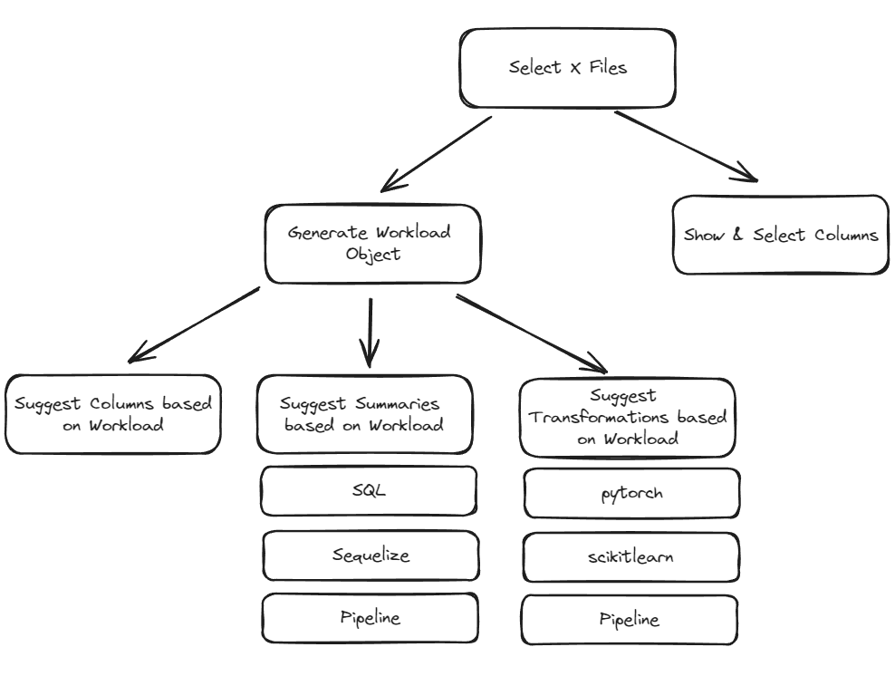
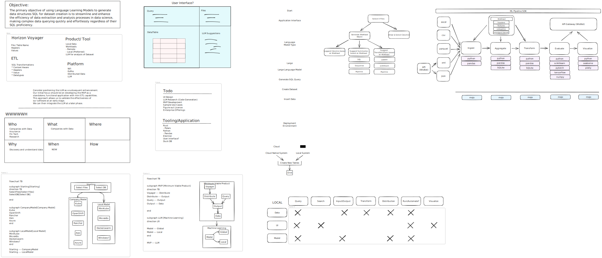

# pyrizon
Python driven data assessment using pandas and flet

## Platform MVP Architecture



### File Workflow Architecture



### Excalidraw Design



## Installation

### Package manager
https://github.com/astral-sh/uv

### Dependencies

```bash
pip install uv
uv sync
```

#### Libraries

```python
import pandas as pd
#TFIDF Feature Extraction Scikit-learn
import sklearn.feature_extraction.text as sk_text
import mysql.connector
import dask
```

## Sample Data Sources

- [Kaggle](https://www.kaggle.com/datasets)
- [UCI Machine Learning Repository](https://archive.ics.uci.edu/ml/index.php)
- [Google Dataset Search](https://datasetsearch.research.google.com/)
- [Data.gov](https://www.data.gov/)

### Solar Flares

Data (CSV) : https://www.kaggle.com/datasets/khsamaha/solar-flares-rhessi
License (CC0) 1.0 :  https://creativecommons.org/publicdomain/zero/1.0/

### Adult Census Data

Data : Becker,Barry and Kohavi,Ronny. (1996). Adult. UCI Machine Learning Repository. https://doi.org/10.24432/C5XW20.
License (Creative Commons Attribution 4.0) : https://creativecommons.org/licenses/by/4.0/legalcode

### Reference

- https://pandas.pydata.org/pandas-docs/stable/reference/api/pandas.read_csv.html
- https://scikit-learn.org/stable/modules/compose.html
- https://scikit-learn.org/stable/auto_examples/ensemble/plot_gradient_boosting_categorical.html
- https://scikit-learn.org/stable/auto_examples/classification/plot_classifier_comparison.html
- https://scikit-learn.org/stable/modules/metrics.html
- https://scikit-learn.org/stable/modules/generated/sklearn.feature_extraction.text.CountVectorizer.html
- https://scikit-learn.org/stable/modules/generated/sklearn.feature_extraction.DictVectorizer.html
- https://scikit-learn.org/stable/modules/generated/sklearn.feature_extraction.text.TfidfTransformer.html#sklearn.feature_extraction.text.TfidfTransformer
- https://scikit-learn.org/stable/modules/generated/sklearn.feature_extraction.text.TfidfVectorizer.html